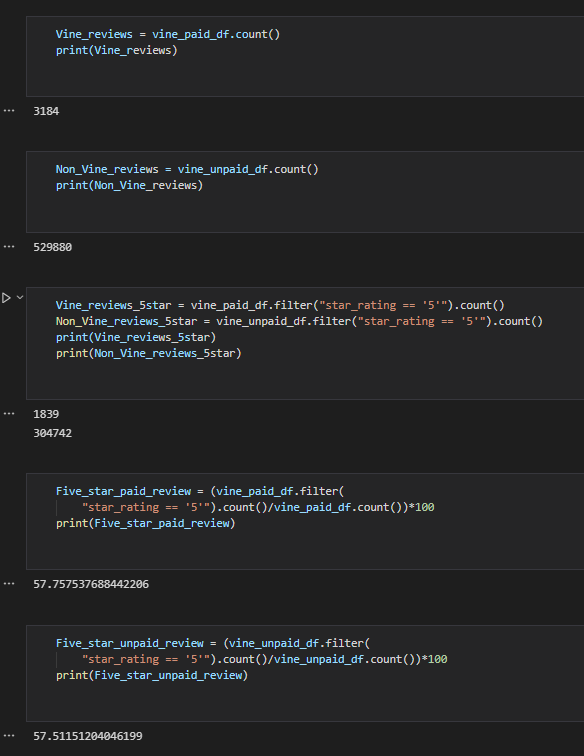

# **Amazon vine Analysis**

**Note:**
I worked with Puneeth N for this challenge. We followed pair-programming methodology and the code and readme were co-created.

## **Overview of the analysis""

Analyzing Amazon reviews written by members of the paid Amazon Vine program.

## **Results**

Using bulleted lists and images of DataFrames as support, the following questions are addressed below:

- How many Vine reviews and non-Vine reviews were there?  
    Vine Reviews: 3184
    Non_Vine Reviews: 529880
- How many Vine reviews were 5 stars? How many non-Vine reviews were 5 stars?  
    5 star Vine Reviews: 1839
    5 star Non_Vine Reviews: 304742
- What percentage of Vine reviews were 5 stars? What percentage of non-Vine reviews were 5 stars?
    Percentage of Vine reviews that are 5 stars: 57.76
    Percentage of non-Vine reviews that are 5 stars: 57.51

## **Summary**

There does not seem to be a positivity bias in the Vine review program. 

To further refine the analysis we can focus on more recent reviews by filtering on review date greater than last one year.